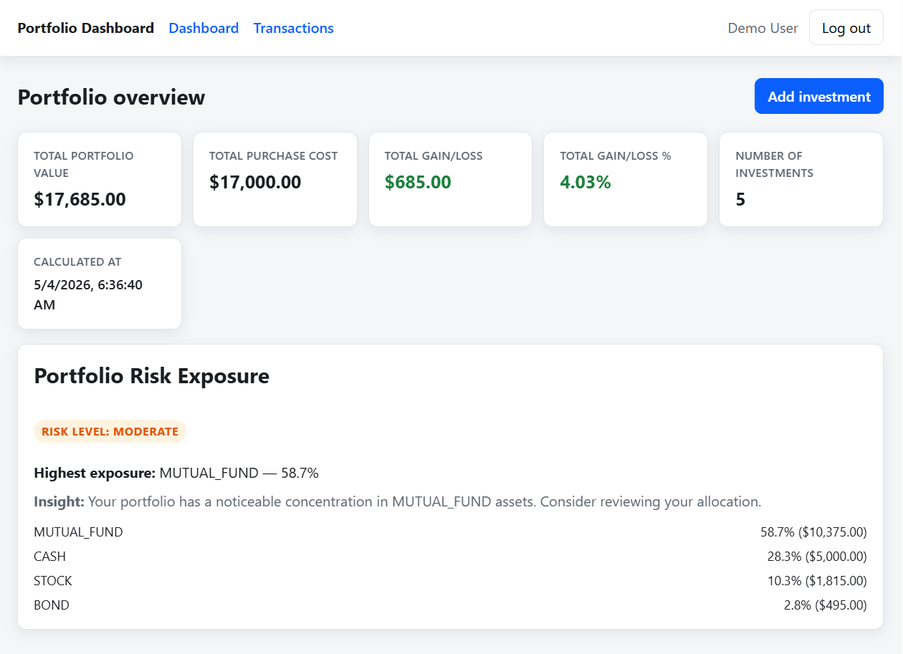
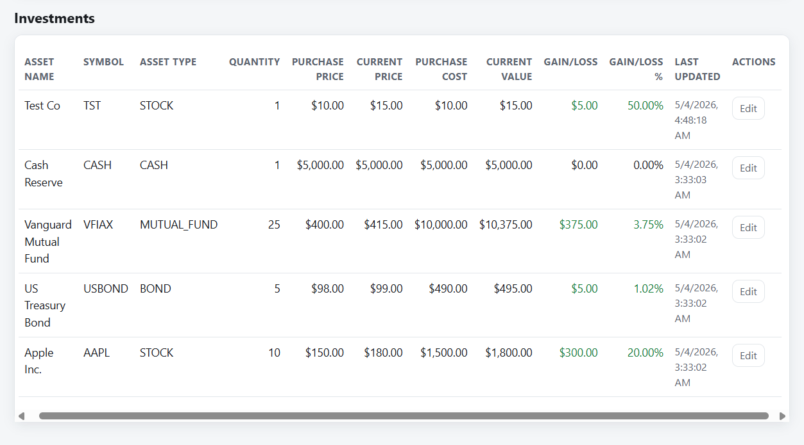

# Portfolio Management Dashboard

Full-stack portfolio dashboard for the Manulife Technology Industrial Placement assessment: JWT auth, portfolio metrics, risk concentration, investments, and transaction history.

**Stack:** React + TypeScript + Vite, Express + TypeScript, PostgreSQL + Prisma.

Business and assessment PDFs are **confidential** (employer / interview use only); do not redistribute them.

## How this maps to the briefs

**Official assessment (Technology Industrial Placement Program 2026)** — required items:

| # | Requirement | Where it lives |
|---|-------------|----------------|
| 1 | JWT login/logout | `POST/GET` under `/api/auth`; UI `/login`, `/register`; token in `localStorage`; **Log out** clears token and returns to sign-in. |
| 2 | Portfolio overview + asset summary (types, current value, purchase price, performance) | Dashboard `/dashboard`: summary cards + investments table; metrics from `GET /api/portfolio/summary` and `GET /api/investments` (derived server-side). |
| 3 | Buy/sell transaction history | `/transactions` + `GET /api/transactions` (newest first, `totalAmount` computed). |
| 4 | Add/edit investments | Modal form on dashboard + `POST/PUT /api/investments` (create wraps investment + **BUY** in one DB transaction; quantity decrease can create **SELL**). |
| 5 | Your choice of FE/BE/DB | React+Vite, Express+TS, PostgreSQL+Prisma. |
| 6 | Deliverable = Docker / Compose | This repo: `docker-compose.yml` + service `Dockerfile`s. |
| — | Git history | Commits on `main` in the remote repo (continue with meaningful messages). |

**Enhanced PRD** (portfolio brief) — additionally implemented: DB `CHECK`s and indexes, risk concentration card (**NONE / LOW / MODERATE / HIGH**), seed user `demo@example.com` / `password123`, REST shapes and validation aligned with the PRD.

**Port note:** the PRD sample maps Postgres to host **5432**. This compose file uses host **5433→5432** so the stack still runs if you already have Postgres on 5432. Inside Docker, the app uses `db:5432` as in the PRD.

## Deliverable: run with Docker Compose

The assessment deliverable is **Docker Compose**. Run the whole system (database, API, UI) with:

```bash
docker compose up --build
```

**Prerequisites:** [Docker](https://docs.docker.com/get-docker/) with the Compose plugin (e.g. Docker Desktop on Windows).

After containers are healthy:

| What | URL |
|------|-----|
| **Web app** | http://localhost:3000 |
| **API base** | http://localhost:5000/api |
| **Health check** | http://localhost:5000/health |
| **Postgres (from host)** | `localhost:5433` → container `5432` (5433 avoids clashes with another Postgres on 5432) |

On first start the **backend** runs `prisma migrate deploy`, **`prisma db seed`**, then starts the server. The **frontend** image is built with `VITE_API_BASE_URL=http://localhost:5000/api` so the browser talks to the API on your machine at port **5000**.

Stop everything:

```bash
docker compose down
```

### Demo login (seeded)

After the stack is up, open **http://localhost:3000/login** and sign in as the pre-seeded demo user:

| Field | Value |
|--------|--------|
| Email | `demo@example.com` |
| Password | `password123` |

The dashboard shows **Demo User** in the nav once you are logged in.

### Screenshots

Portfolio overview (summary cards and risk exposure):



Investments table (holdings, metrics, and edit actions):



## Features

- User registration and login with **bcrypt** and **JWT** (Bearer token; default expiry 1 hour via `JWT_EXPIRES_IN`).
- **Portfolio summary** with totals, gain/loss, allocation by asset type, and **risk exposure** (NONE / LOW / MODERATE / HIGH) computed from holdings (not stored as derived columns).
- **Investments:** list, add (atomic **BUY**), edit (optional **SELL** when quantity decreases). Ownership checks on every call.
- **Transaction history** (newest first) with computed **total amount**.

## API overview

| Method | Path | Auth | Description |
|--------|------|------|-------------|
| POST | `/api/auth/register` | No | Create user |
| POST | `/api/auth/login` | No | Returns JWT + user |
| GET | `/api/auth/me` | Yes | Current user |
| GET | `/api/investments` | Yes | List investments + derived metrics |
| POST | `/api/investments` | Yes | Create investment + BUY |
| PUT | `/api/investments/:id` | Yes | Update; SELL if quantity drops |
| GET | `/api/portfolio/summary` | Yes | Totals, allocation, risk |
| GET | `/api/transactions` | Yes | Transaction history |

Protected routes: `Authorization: Bearer <token>`.

## Database

Prisma models `User`, `Investment`, `Transaction` with PostgreSQL **foreign keys**, **CHECK** constraints on numeric fields, and indexes on `user_id`, `symbol`, and `transaction_date`. Financial metrics are calculated in the API, not persisted as source of truth.

## Design notes

- **Atomic writes:** new investment + initial BUY in one transaction.
- **Ownership:** data scoped to the authenticated user.
- **Risk:** concentration by current value per `AssetType` (PRD thresholds 50% / 75%).

## Known limitations

- No live market or brokerage APIs (per PRD).
- No refresh-token rotation or RBAC.
- Compose `JWT_SECRET` / DB password are for **local demo only**.
